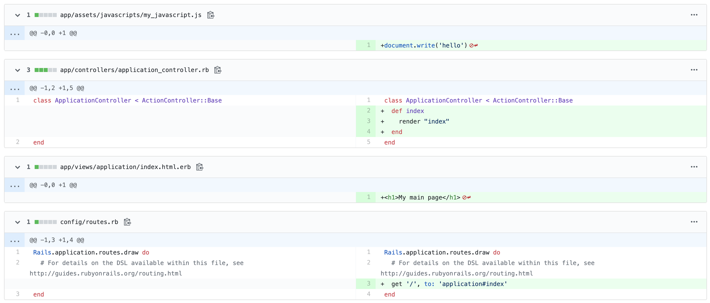

# Asset Pipeline Demo

## Resources
* [What is Cache Busting](https://www.keycdn.com/support/what-is-cache-busting)
* [Asset Pipeline](https://edgeguides.rubyonrails.org/asset_pipeline.html)
* [Layouts and Rendering in Rails](https://guides.rubyonrails.org/layouts_and_rendering.html)
Rails includes the "Asset Pipeline" to help manage dependencies for JavaScript
and CSS. One especially helpful thing the Asset Pipeline does is introduce a
mechanism to manage the browser cache.

## The Browser Cache
Have you ever edited a file, refreshed your web page and not seen the changes
come through? This happens when your browser has cached the file. Caching means
it reuses an old saved version of the file instead of redownloading the file
again. This speeds up page load times. If the browser ever detects the file
has changed it will redownload the new version of the file.

Sometimes the browser doesn't notice the file has changed and doesn't download
the new version. It sees a reference to a file with a name that it's downloaded
and cached before and it uses that old version.

Rails fixes this caching problem by adding a "fingerprint" to files. The
fingerprint is a hash (a string that looks like "dfs2bff462...") that's
generated based on the contents of the file. If the file ever changes then the
hash changes and the file has a new name. When an HTML file references a CSS of
JavaScript file it now has the hash fingerprint and your browser sees it as
a file with a unique name and it forces the browser to download the new version
of the file. Instead of the browser caching different versions of the file with
the same name, now the filename changes whenever the file changes so the
browser will only cache the file according to each version of the file.

This entire problem and technique is called Cache Busting. Read more about it
by following the link in the list of resources below!

## Is Your Server An API-Only Server or a Server Server?
This guide assumes you created your application with `rails new my_server`. If
you created your rails application using `rails s my_api_server --api` with the
`--api` flag specifically you will need to perform extra steps to configure
this.

If you created your rails application using the `--api` flag see the 
[Converting an API-only Server to a Server Server](#converting-an-api-only-server-to-a-server-server) section below.

## Project Structure
Rails has a special place it looks for CSS and JavaScript files. It
expects them to be in `app/assets/javascripts` and `app/assets/stylesheets`.
You'll see two files `application.js` and `application.css` already in these
asset directories. These files define dependencies on other `.js` and `.css`
files. They each include a line `*= require_tree .` which will automatically
include all the `.js` and `.css` files in that directory.

Rails makes these methods (`stylesheet_link_tag` and `javascript_include_tag`)
available so you can render references to JavaScript and CSS in your views.
These lines are included inside the main app template
`app/views/layout/application.html.erb`.

```erb
<%= stylesheet_link_tag "application", media: "all" %>
<%= javascript_include_tag "application" %>
```

## How to Get It Working


Refer to [this commit diff](https://github.com/moondump/asset-pipeline-demo/commit/0087cb686bdead899d7263988c6410d7d7f25ec2)
to see what changes it takes to get your own JavaScript attached to your web
pages using Rails Asset Pipeline.

* Create a file `app/assets/javascripts/my_javascript.js`
* Create a file `app/views/application/index.html.erb`
* Add the following contents to each file


**app/assets/javascripts/my_javascript.js**
```js
document.write('hello from my custom tiny JS file') 
```

**app/views/application/index.html.erb**
```html
<h1>Just Some Tiny Custom HTML</h1>
```

Modify the `ApplicationController` to have a method that renders the
Application index view. This refers to the tiny HTML file above which
lives at `app/views/application/index.html.erb`.

Add a call to the method `protect_from_forgery_with` to configure the
ApplicationController to not look for CSRF tokens in forms. Rails usually
looks for these tokens on HTML forms, but this will interfere with normal
POST API requests if we don't disable it.

**app/controllers/application_controller.rb**
```ruby
class ApplicationController < ActionController::Base
  # https://stackoverflow.com/a/35184796
  protect_from_forgery with: :null_session

  def index
    render "index"
  end
end
```

Include a route that renders the view. Views are rendered within the overall
application layout defined in `app/views/layout/application.html.erb`. Since
the overall layout includes the call to `javascript_include_tag` and
`stylesheet_link_tag` the view will include proper references to all the CSS
and JavaScript files placed in your `app/assets/javascripts` folder.

**config/routes.rb**
```ruby
Rails.application.routes.draw do
  get '/', to: 'application#index'
end
```

## Cache Busting
Have you ever edited a JavaScript or CSS file, saved it, refreshed your browser
and not seen changes come through? Sometimes this happens when your browser
caches the file you've changed. The browser notices you've retrieved
`/src/my_javascript.js` before and it skips downloading it again because it
thinks it hasn't changed. 
 
Rails helps prevent this by appending a specific hash at the end of a link to
any CSS or JavaScript file. The hash makes the file look like
`/src/my_javascript.self-af89d234c3e28js`. The hash is generated based on the
contents of the file. If you edit the file the file contents change and the
hash will change. The new hash in the filename will force the browser "bust
it's cache" and download the file again because it thinks it's never seen this
file before.

So, instead of your files always having the same name (like below) the Rails
Asset Pipeline adds a hash to each filename (seen further below). This helps
prevent browsers from using stale resource. Viola.

```html
<link rel="stylesheet" media="all" href="/assets/application.css" />

<script src="/assets/rails-ujs.js"></script>
<script src="/assets/activestorage.js"></script>
<script src="/assets/turbolinks.js"></script>
<script src="/assets/action_cable.js"></script>
<script src="/assets/cable.js"></script>
<script src="/assets/my_javascript.js"></script>
<script src="/assets/application.js"></script>
```

```html
<link rel="stylesheet" media="all" href="/assets/application.self-f0d704deea029cf000697e2c0181ec173a1b474645466ed843eb5ee7bb215794.css?body=1" data-turbolinks-track="reload" />

<script src="/assets/rails-ujs.self-2b8935521e2301b06b45bd42e623eb0c0acf76c3a6ba383b7429c6a2884f8c23.js?body=1" data-turbolinks-track="reload"></script>
<script src="/assets/activestorage.self-1ed4604ac2170045f1ffca4edb81a75246661555e4f9cf682bb8a21825e32e1c.js?body=1" data-turbolinks-track="reload"></script>
<script src="/assets/turbolinks.self-569ee74eaa15c1e2019317ff770b8769b1ec033a0f572a485f64c82ddc8f989e.js?body=1" data-turbolinks-track="reload"></script>
<script src="/assets/action_cable.self-69fddfcddf4fdef9828648f9330d6ce108b93b82b0b8d3affffc59a114853451.js?body=1" data-turbolinks-track="reload"></script>
<script src="/assets/cable.self-8484513823f404ed0c0f039f75243bfdede7af7919dda65f2e66391252443ce9.js?body=1" data-turbolinks-track="reload"></script>
<script src="/assets/my_javascript.self-b91fd6c62b4c5c373535aa39766bef067fd709b0349400b3939b46af645bdf2a.js?body=1" data-turbolinks-track="reload"></script>
<script src="/assets/application.self-66347cf0a4cb1f26f76868b4697a9eee457c8c3a6da80c6fdd76ff77e911715e.js?body=1" data-turbolinks-track="reload"></script>
```

## Converting an API-only Server to a Server Server
A rails application created with the `--api` flag is not configured to serve
HTML/CSS and JavaScript by default. An API server is specifically configured to
receive network requests and return data. Here's how to convert an API server
back to a "server server."

Refer to
[this commit](https://github.com/moondump/asset-pipeline-demo/commit/e615d324060541fa46996021aed1b37930d343ff)
to see the necessary changes.

1. Navigate to `config/application.rb` and set `config.api_only` to `false`.

```ruby
config.api_only = false
```

2. Navigate to `config/routes.rb` and add a root route `GET /` going to
   `application#index`. Don't change any of your `/api/v1` routes.

```ruby
Rails.application.routes.draw do
  get '/', to: 'application#index'

  namespace :api do
    namespace :v1 do
      resources :notes, only: [:index, :update]
    end
  end
end
```

3. Go to `app/controllers/application_controller.rb` and do two things:
  * Change it so it inherits from `ActionController::Base` instead of `ActionController::API`
  * Add a method `index` that returns `"index"` to configure it to render
    `index.html.erb` located at `app/views/application/index.html.erb`. (It
    looks for the directory named `application` inside `views/` because the name
    `ApplicationController`.)

```ruby
class ApplicationController < ActionController::Base
  def index
    "index"
  end
end
```

4. Create the file `app/views/application/index.html.erb`. Create directories
   for `views/` and `application/` if they don't exist. Add some minimal HTML
   in the file that positively identifies the page is being rendered.

```
<h1>application index</h1>
```

5. Navigate to <http://localhost:3000/> and verify you see the HTML with the
   "application index" header.

6. Create the file `app/views/layouts/application.html.erb`. Use this template.
   Notice there's a `<style>` tag that defines a background color. Refresh
   <http:localhost:3000/> to verify the background color changes and you still
   see the "application index" header.

```erb
<!DOCTYPE html>
<html>
  <head>
    <title>AssetPipelineDemo</title>
    <%= csrf_meta_tags %>
    <%= csp_meta_tag %>

    <%= stylesheet_link_tag    'application', media: 'all', 'data-turbolinks-track': 'reload' %>
    <%= javascript_include_tag 'application', 'data-turbolinks-track': 'reload' %>
  </head>

  <body>
    <%= yield %>
  </body>
</html>
```

8. Paste these gem requirements at the end of your Gemfile. Run `bundle` to
   install them. Restart your server with `rails s`.

```
# Use SCSS for stylesheets
gem 'sass-rails', '~> 5.0'
# Use Uglifier as compressor for JavaScript assets
gem 'uglifier', '>= 1.3.0'
# Turbolinks makes navigating your web application faster. Read more: https://github.com/turbolinks/turbolinks
gem 'turbolinks', '~> 5'
```

7. Create directories and files for these files and include the following contents:

* `app/assets/stylesheets/application.css`
* `app/assets/stylesheets/my_style.css`
* `app/assets/javascripts/application.js`
* `app/assets/javascripts/my_javascript.js`

Notice that the CSS file `my_style.css` redefines the background color of the
page to green. Remove the `<style>` tag which set the background color to `goldenrod`
in `application.html.erb` in the last step.

After creating these files refresh <http://localhost:3000> and confirm the
background color changes to green and JavaScript writes `"random number:"`
at the top of the screen on every reload.

**app/assets/stylesheets/application.css**
```css
/*
*= require_tree .
*= require_self
*/
```

**app/assets/stylesheets/my_style.css**
```css
body {
  background-color: green;
}
```

**app/assets/javascripts/application.js**
```js
//= require rails-ujs
//= require activestorage
//= require turbolinks
//= require_tree .
```

**app/assets/javascripts/my_javascript.js**
```css
document.write('random number: ' + Math.random())
```

8. View the source of your page and view the JavaScript and CSS links to verify
   they include long hash fingerprints in their filenames. They should look
   something like this:

```html
<link rel="stylesheet" media="all" href="/assets/application-aee27f554ff148e65f4e540925afd3b4e142fd29d392bfe2464d621c61e1de25.css" data-turbolinks-track="reload" />
<script src="/assets/application-df51ecc7477b83246ea8fd26a8fed5353e42d86c20284def7530884aa52cbe46.js" data-turbolinks-track="reload"></script>
```

# Complete
That should be it. Your server should now be configured to serve cache-busting
hash-finger-printed CSS and JavaScript files. If you have any problems
following this guide please file an issue, and a PR if you already have a
corresponding fix.


